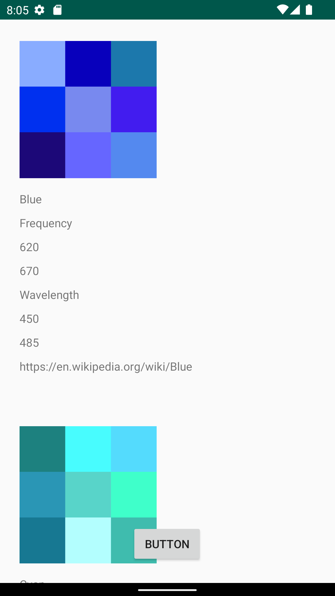
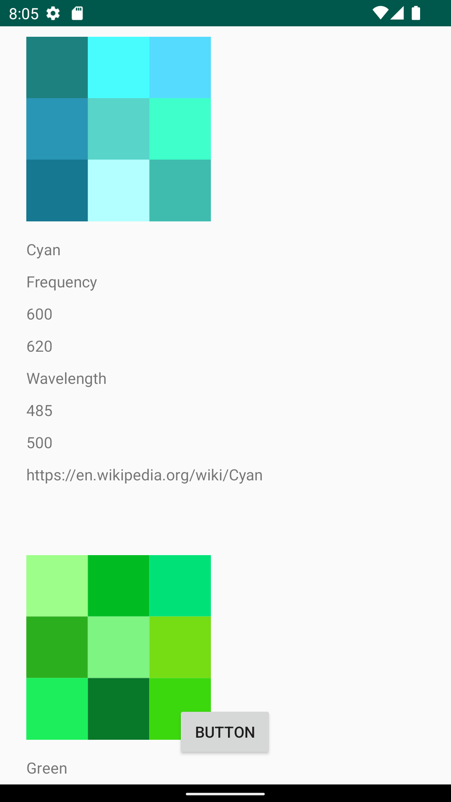
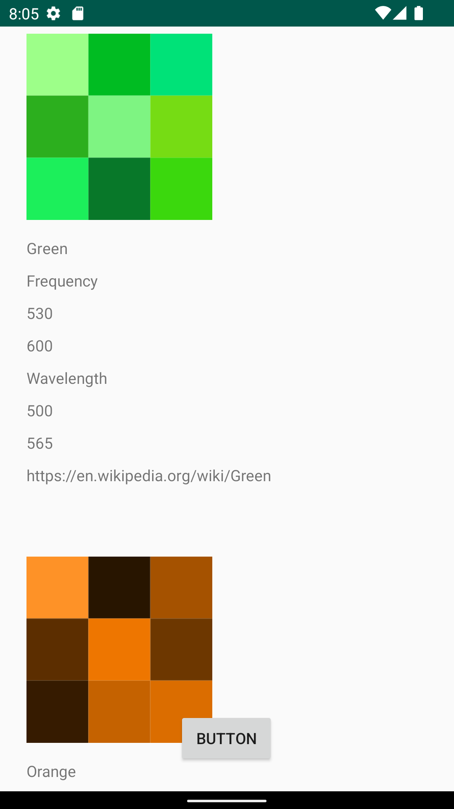
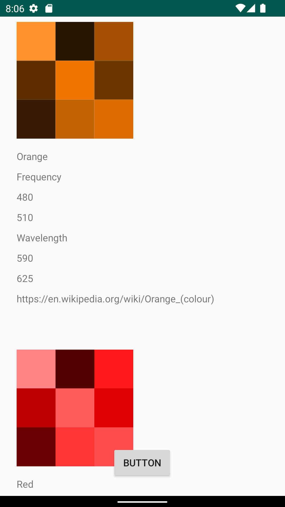
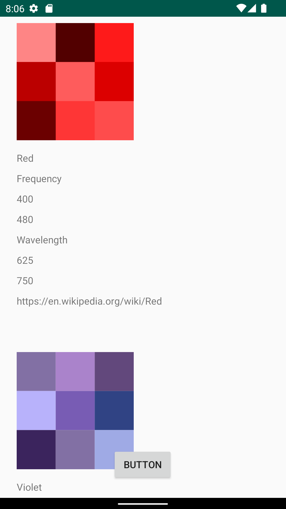
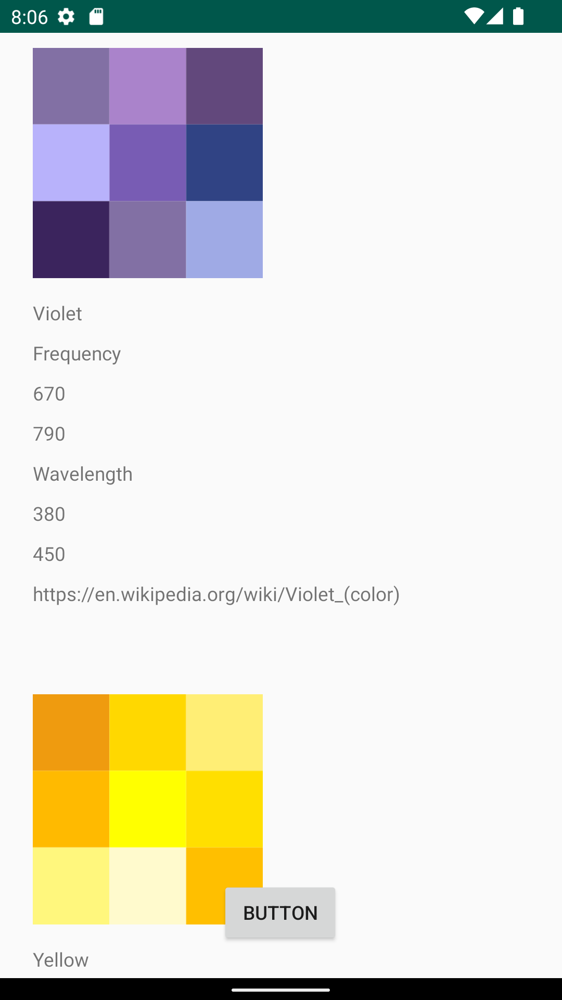
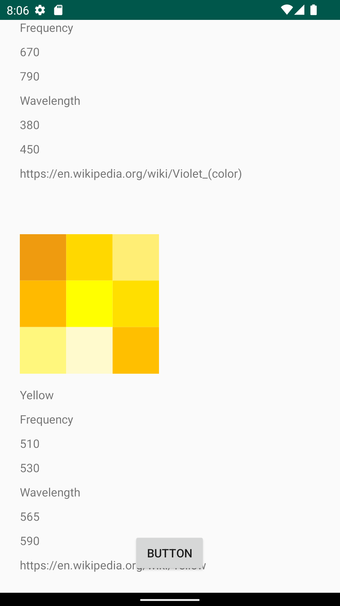
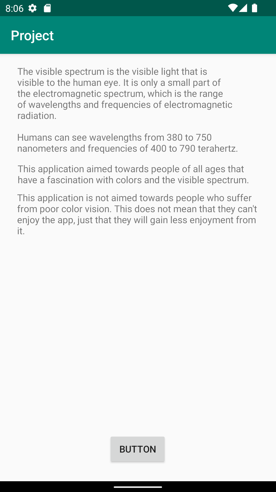

# Rapport

This project is based upon code that was written in earlier assignments. The code was cleaned up and updated to fit better with what the project needed.
The project began with the creation of three classes: Color.java, RecyclerViewAdapter.java and Auxdata.java.
A recyclerview layout was created that would show the json data. 
Code was added that would handel the json data (JsonFile.java and JsonTask.java)

Json data was writen in course web service. The web service use the tags: ID, Login, Size, Location, Name, company, category and Auxdata.
The tags were not renamed nor were new ones created for the project. The tags that were already there were used to better fit this project. Size and company were used to store max and minimum wavelenght,
location and cost were used for max and minimum frequency. The AuxData tag hold a link to the associated wiki page and a link to an associated image.

Below are new bits of code that were added to this project.


This is code for the back button, to return from the about page to the main page.
```
  buttontwo =(Button) findViewById(R.id.buttontwo);

        buttontwo.setOnClickListener(new View.OnClickListener() {
            @Override
            public void onClick(View view) {
                openActivity1();
            }
        });
    }
    public void openActivity1(){
        Intent intent = new Intent(this, MainActivity.class);
        startActivity(intent);
    }
}
```
This is the code used to show images in the recyclerview, upon failure to load image from auxdata a an error image is shown.
```
Picasso.get()
                .load(colors.get(position).getAuxdata().getImg())
                .into(holder.img, new Callback() {
                    @Override
                    public void onSuccess() {}

                    @Override
                    public void onError(Exception e) {
                        Picasso.get().load("https://i.ibb.co/wC7Q8zm/Untitled.png").into(holder.img);
                    }
                });
```

Screenshots that show everything in the recyclerview and about page.









